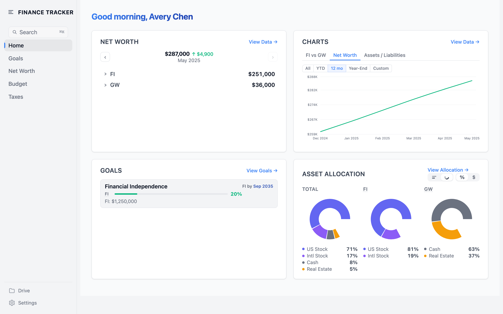
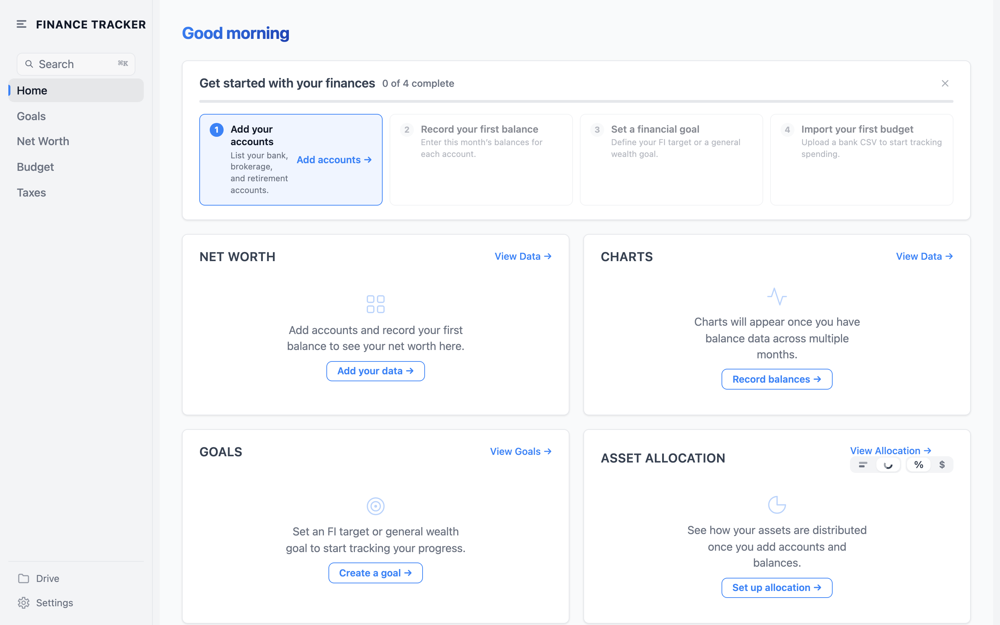
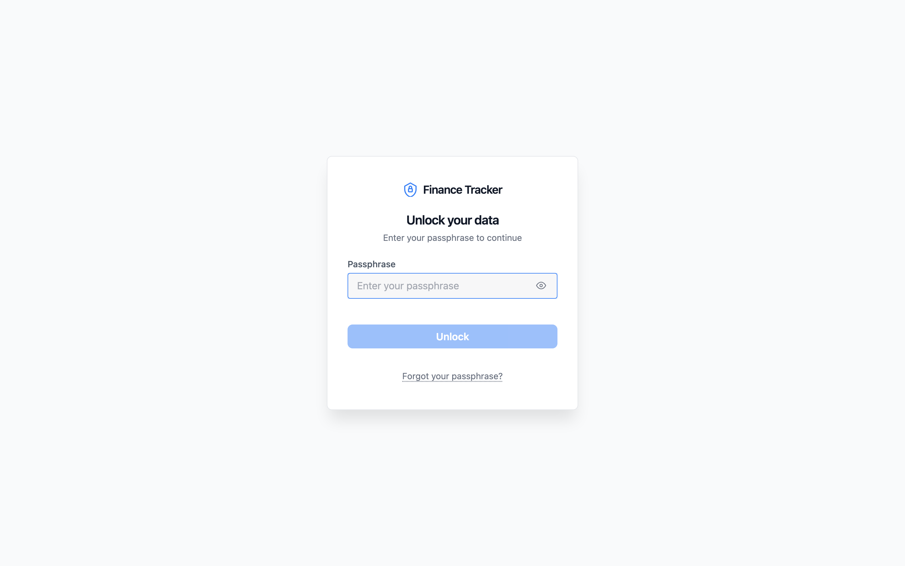
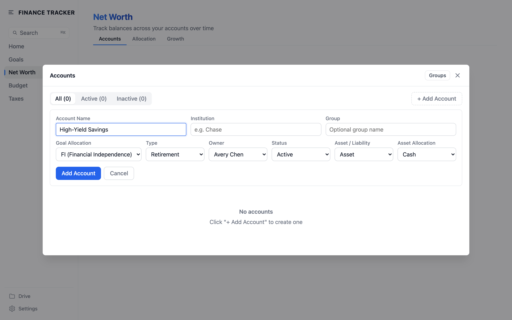
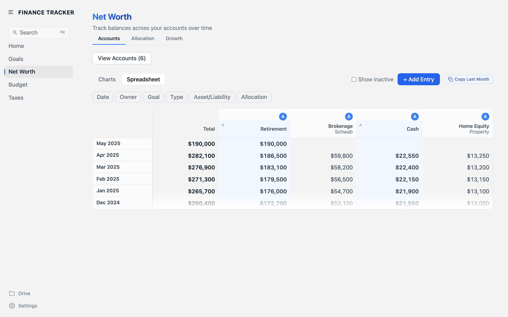
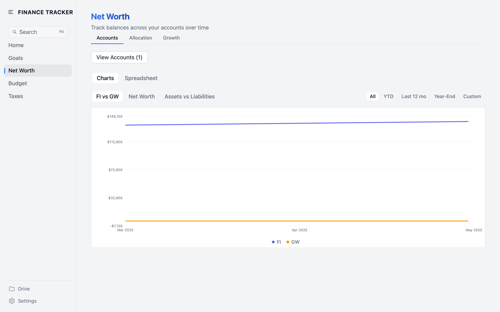
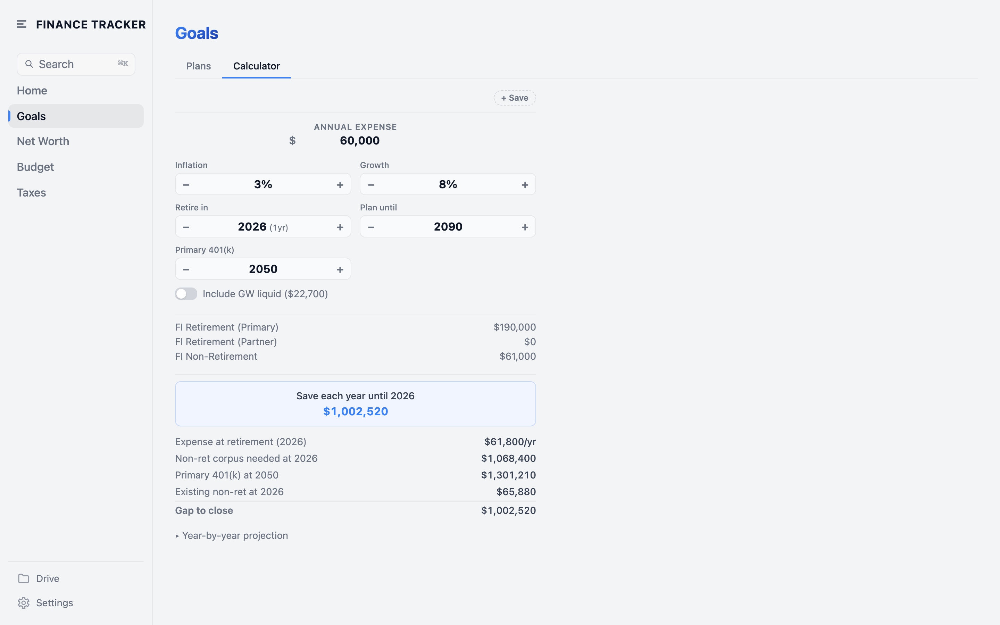
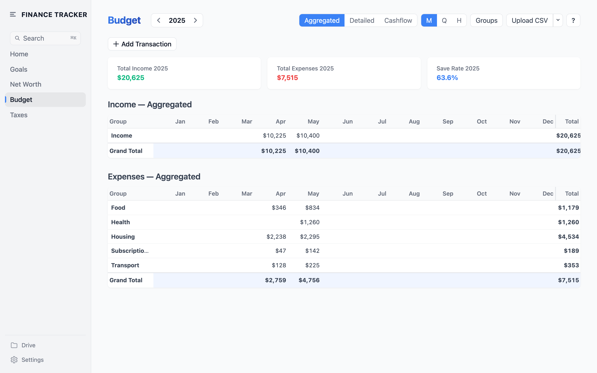
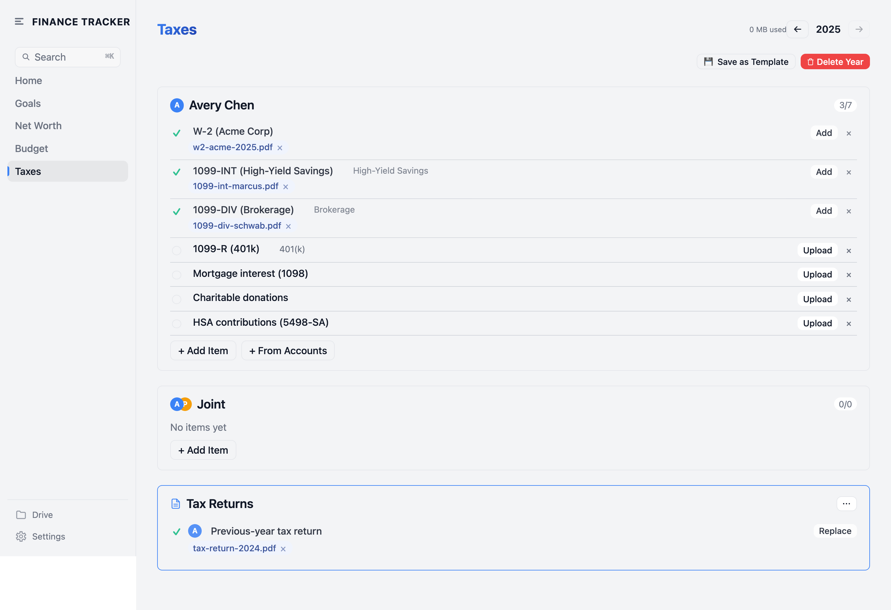
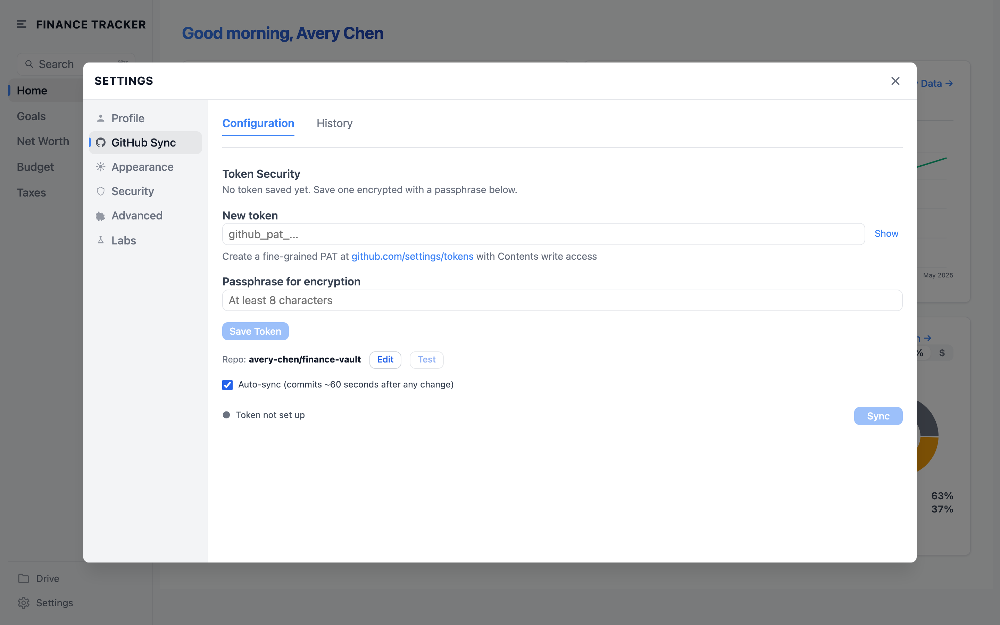

# finance-tracking

**Your money, in your browser, and nowhere else.**

This is a personal finance app for one person, and it lives entirely in your browser. It tracks your net worth, your budget, your savings goals, and your taxes; the data can be encrypted on your device with a passphrase you choose, and never touches a server I run.  If you want a backup, it can sync to a private GitHub repository of your own. Nothing else leaves your machine, and nothing about you is for sale.

- Browser only.
- Encrypted on your device.
- No lock-in.

[**Open the app →**](https://anindya.dev/finance-tracking)

---

## Why this exists

It is a Sunday morning and I have a spreadsheet open that I have kept, on and off, for the better part of a decade. The date column is wider than it needs to be, in a green I never quite picked on purpose, and the formula in the last row has been broken for two months without me noticing. Before this spreadsheet there were others. There was Mint, while it lasted; there was a subscription app that asked, very politely, for the login to my bank; there was a notebook I kept for one quarter and then misplaced behind a stack of books I was meaning to read. None of them stayed. The spreadsheet stayed, in its half-broken way, because nobody could take it from me.

The pattern repeats. The good apps die or get bought and become something else; the subscriptions keep charging long after I have stopped opening them; the free ones want my bank credentials, and somewhere down in the terms of service is a sentence about how my data may be used to improve the product, which is the polite phrasing for sold. The spreadsheets survive in a quieter way, but they live in browser tabs I forget to close and folders I forget to back up, and the formulas drift, and one day a cell refers to a sheet that no longer exists. None of it ever felt like mine. It always felt borrowed. And there is a small embarrassment, after a while, in handing the keys to your financial life to a company that needs to grow every quarter to keep its lights on, and pretending the arrangement is normal.

So this is small, on purpose. It runs in your browser. If you set a passphrase, the data is encrypted before it touches your disk, and the key stays with you;  if you want a backup, you can sync to a private GitHub repository of your own, and that is the only place it ever leaves your machine. There is no account to create. There is no server I run. There is no analytics pixel sitting in the corner of the page, quietly counting how long you spent on the budget screen. It is a small app for one person to keep their own books, on a Sunday morning, in a green they did not quite pick on purpose.

---

## Privacy & data

What follows is the literal version of the promise above. Where your data lives, how it's encrypted, and what this app does not do.

### Where your data lives

Your browser. Not the cloud. Every account, balance, transaction, goal, and tax document is stored in `localStorage` and `IndexedDB` on the device you're using right now. Close the tab, reopen it, the data is still there. Open it on a different device and you'll start from scratch unless you turn on GitHub Sync.

### What "encrypted at rest" means

When you set a passphrase, sensitive data is encrypted with AES-256-GCM before it's written to your browser. That includes account balances, transactions, goals, and tax documents. If someone opens devtools and inspects your storage, they see ciphertext. The encryption key is derived from your passphrase using PBKDF2 with 600,000 iterations, and the key itself is never stored. It exists in memory only while the app is unlocked.

### What GitHub Sync does

GitHub Sync is opt-in. When you turn it on, the app pushes an encrypted snapshot of your data to a private GitHub repo that you create and own. You provide a personal access token with `repo` scope. The token is stored encrypted in your browser. The repo is yours, the data in it is already encrypted, and you can revoke the token from GitHub settings at any time.

### What this app does not do

No analytics. No third-party scripts. No accounts. No backend. No telemetry, no error reporting, no fingerprinting. No data ever leaves your browser unless you turn on GitHub Sync. You can verify this by opening the Network tab in devtools and watching the app do nothing.

### The trade-off, stated honestly

If you lose your passphrase, your encrypted data is unrecoverable. There is no password reset. There is no support team with a backdoor. There is no recovery email. This is by design.

---

## Quick start (5 minutes)

### 1. Open the app

Go to [anindya.dev/finance-tracking](https://anindya.dev/finance-tracking) in any modern browser. Nothing to install. No signup screen. The app loads and you're in.

### 2. Set a passphrase

In Settings, set a passphrase. This encrypts your data at rest. Pick something you'll remember, because there is no reset. You can skip this step and add encryption later, but if you plan to use GitHub Sync, set it now.

### 3. Add your first account

Go to Net Worth and add an account. Give it a name (e.g. "Chase checking"), pick a type (checking, savings, retirement, real estate, vehicle), and save. You can add more later.

### 4. Enter a balance

Click into the account and enter today's balance. That's one data point. Come back next month and add another. Over time, this becomes your net worth history.

### 5. See your net worth

Go to Home. Your net worth, allocation, and recent activity are on the dashboard. Add a few more accounts and the picture gets sharper.

---

## Features, by page

### Home

Your dashboard. Today's snapshot of net worth, savings rate, goal progress, and recent activity.

**How to use it**
- Glance at the summary cards to see where you stand today
- Click any card to jump to its full page
- Use the date selector to compare this month to last
- Check the activity feed for the last balances and transactions you entered

**One tip:** Pin the cards you care about most. The dashboard re-renders in the order you set, so put goal progress first if that's what you check daily.

---

### Net Worth

Track balances over time. Add accounts, enter monthly balances, see how everything moves together.

**How to use it**
- Add an account for each real-world account you want to track (checking, savings, retirement, real estate, vehicle)
- Enter a balance once a month per account
- Switch between the allocation view and the growth chart
- Filter by account type to see retirement vs. cash vs. real estate separately
- Use the year-over-year toggle to see compounding

**One tip:** Pick one day a month (the 1st works well) and update every account that day. Consistency beats accuracy. A balance on the same day each month gives you a clean growth curve.

---

### Goals

Set a financial-independence target and track progress toward it. Add sub-goals for things you're saving up for.

**How to use it**
- Enter your annual expenses to get a default FI number (25x expenses)
- Override it if you have a different target
- Add sub-goals for shorter-term things (down payment, sabbatical fund, emergency fund)
- Watch progress update automatically as your net worth changes
- Set a target date to see the savings rate you need to hit it

**One tip:** Set your FI number using your *post-FI* expenses, not your current ones. Most people spend less once they stop commuting, eating out for work, and paying for childcare.

---

### Budget

Import bank and credit-card CSVs, categorize transactions, and see your savings rate.

**How to use it**
- Export a CSV from your bank or card issuer
- Drop it onto the Budget page to import
- Review the auto-categorization and fix anything wrong
- Edit categories to match how you actually think about spending
- Switch between monthly, quarterly, and yearly views
- Read your savings rate (income minus expenses, divided by income) at the top

**One tip:** Categorize once, save the rule. The app remembers vendor-to-category mappings, so next month's import will pre-categorize anything it has seen before. Five minutes of cleanup in month one saves you an hour by month three.

---

### Taxes

Annual tax checklist, document storage, and estimated payments tracker.

**How to use it**
- Work through the checklist for the current tax year
- Upload W-2s, 1099s, K-1s, and receipts as you receive them
- Log estimated payments by quarter
- Carry forward the prior year's checklist as a starting template
- Mark items complete to track progress toward filing

**One tip:** Tax documents are encrypted in IndexedDB, not localStorage. They can be large, and IndexedDB handles size better. If you turn on GitHub Sync, tax PDFs sync too, so a fresh device gets your full filing history.

---

### Drive & Settings

GitHub Sync setup, data export and import, profile, preferences, dark mode.

**How to use it**
- Set or change your passphrase
- Turn on GitHub Sync and paste your personal access token
- Export your full dataset as a JSON file (encrypted or plaintext, your choice)
- Import a previously exported file to restore or migrate
- Toggle dark mode, set your currency, set your fiscal year start

**One tip:** Export a plaintext JSON backup once a quarter and store it somewhere safe (encrypted disk, password manager file vault). Encrypted backups are useless without your passphrase. A plaintext backup in a vault is a real disaster-recovery plan.

---

## Common questions

### Is this free?

Yes. Forever. No paid tier, no premium features, no upsell. The app is open source under MIT.

### Where does my data go?

Your browser. It stays in `localStorage` and `IndexedDB` on the device you're using. If you turn on GitHub Sync, an encrypted copy also goes to a private GitHub repo that you own. That's it.

### What if I switch devices?

You have two options. Turn on GitHub Sync to keep devices in sync automatically, or use Export on one device and Import on the other. Without one of those, each device is independent.

### What if I lose my passphrase?

Your encrypted data is unrecoverable. There is no reset, no backdoor. Store your passphrase in a password manager. See "The trade-off, stated honestly" above for the full reasoning.

### Can I export my data?

Yes. Settings has a one-click export as JSON. You can export encrypted or plaintext. Plaintext is portable and human-readable. Encrypted is safe to store in any cloud.

### Is this open source?

Yes. MIT license. Source is at [github.com/dutta14/finance-tracking](https://github.com/dutta14/finance-tracking). Read it, fork it, run it yourself.

### Does it work offline?

Yes, once loaded. The app is a static bundle. After the first visit, your browser caches it and you can use it on a plane, in a tunnel, or with your wifi off. GitHub Sync just queues up and runs when you're back online.

### Why no mobile app?

The web app works on mobile browsers, and a native app would require an account system, an app store, and a backend. The whole point of this app is that none of those exist. Add the site to your home screen on iOS or Android and it behaves like an app.

### Is this audited or production-grade?

No formal audit. One person built it. It's used daily by its author. The crypto uses standard Web Crypto primitives (AES-256-GCM, PBKDF2 at 600,000 iterations). Treat it as a personal tool, not a bank.

### Why should I trust this?

You shouldn't blindly trust anything with your financial data. Here's what's true: the source code is public, the app makes no network calls except optional GitHub Sync (which you can verify in devtools), and your data never leaves your browser. Read the code. Or just try it with one account and see for yourself.

---

## More

- **Self-host or contribute:** see [CONTRIBUTING.md](./CONTRIBUTING.md)
- **Source code:** [github.com/dutta14/finance-tracking](https://github.com/dutta14/finance-tracking)
- **Anindya's blog:** [anindya.dev/blog](https://anindya.dev/blog)
- **License:** MIT

Built in the open, for an audience of one. Useful to anyone who wants the same thing.
