# finance-tracking

**Your money, on your own disk, and nowhere else.**

This is a personal finance app for one person, and it runs entirely in your browser with your data stored as plain files in a folder you choose on your own machine. It tracks your net worth, your budget, your transactions, your savings goals, your tax documents, and the little Sunday-morning habits that make all of that sustainable over time. Nothing ever touches a server I run, and nothing about you is for sale.

- Browser only (Chrome or Edge).
- Data lives in a folder you own.
- No lock-in.

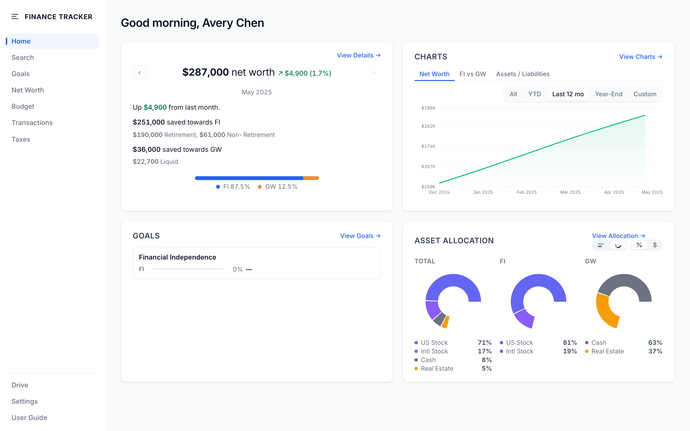

---

## Why this exists

It is a Sunday morning and I have a spreadsheet open that I have kept, on and off, for the better part of a decade. The date column is wider than it needs to be, in a green I never quite picked on purpose, and the formula in the last row has been broken for two months without me noticing. Before this spreadsheet there were others. There was Mint, while it lasted; there was a subscription app that asked, very politely, for the login to my bank; there was a notebook I kept for one quarter and then misplaced behind a stack of books I was meaning to read. None of them stayed. The spreadsheet stayed, in its half-broken way, because nobody could take it from me.

The pattern repeats. The good apps die or get bought and become something else; the subscriptions keep charging long after I have stopped opening them; the free ones want my bank credentials, and somewhere down in the terms of service is a sentence about how my data may be used to improve the product, which is the polite phrasing for sold. The spreadsheets survive in a quieter way, but they live in browser tabs I forget to close and folders I forget to back up, and the formulas drift, and one day a cell refers to a sheet that no longer exists. None of it ever felt like mine. It always felt borrowed. And there is a small embarrassment, after a while, in handing the keys to your financial life to a company that needs to grow every quarter to keep its lights on, and pretending the arrangement is normal.

So this is small, on purpose. It runs in your browser. Your data is a folder of plain files on your own disk, open to any backup tool you already trust: Time Machine, Dropbox, iCloud Drive, git, rsync, whatever. There is no account to create. There is no server I run. There is no analytics pixel sitting in the corner of the page, quietly counting how long you spent on the budget screen. It is a small app for one person to keep their own books, on a Sunday morning, in a green they did not quite pick on purpose.

---

## Privacy & data

What follows is the literal version of the promise above. Where your data lives, and what this app does not do.

### Where your data lives

A folder on your own machine. Not the cloud. On first run the app shows a full-page screen asking you to choose a data folder. Once you pick one, every account, balance, transaction, goal, tax checklist item, uploaded file, and budget record is written there as plain files: JSON for most things, CSV for monthly balance and transaction data. The chosen folder handle is remembered in IndexedDB so the browser can reconnect on your next visit without asking again.

The files are human-readable and directly editable. Open them in any text editor. Open the CSVs in Excel or Numbers. They are yours.

A handful of UI preferences stay in `localStorage`: dark mode, accent theme, the CSV import toggle, and a few feature-flag seeds. Nothing sensitive lives there.

### What "backups" means now

The data folder is ordinary files. Use whatever backup tool you already use: Time Machine, Dropbox, iCloud Drive, git, rsync. If you want to use this on two machines, point both at the same synced folder, or copy the folder from one machine to the other. The app has no built-in sync mechanism because it does not need one.

### What this app does not do

No analytics. No third-party scripts. No accounts. No backend. No telemetry, no error reporting, no fingerprinting. No data ever leaves your device. You can verify this by opening the Network tab in devtools and watching the app do nothing.

### The trade-off, stated honestly

Your data is plain files with no encryption layer of its own. It is exactly as protected as your disk is. If you are on a shared machine or you store the folder somewhere accessible to others, that is a real concern. Use full-disk encryption (FileVault, BitLocker, or equivalent) if you need the data protected at rest. The app will not do that for you.

The other constraint: this uses the File System Access API, which is available in Chrome and Edge but not in Firefox or Safari. The folder picker screen says so explicitly.

---

## Quick start (5 minutes)

### 1. Open the app

Go to [anindya.dev/finance-tracking](https://anindya.dev/finance-tracking) in Chrome or Edge. Nothing to install. No signup screen.

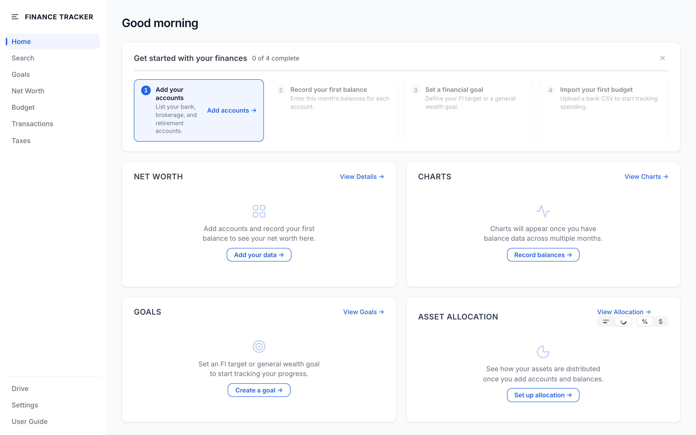

### 2. Choose your data folder

The first thing you see is a full-page screen asking you to pick a folder where the app will store your files. Click "Choose Folder", pick (or create) an empty folder somewhere on your machine, and grant read and write access when the browser asks. The app remembers that folder and reconnects on your next visit without asking again. You can change or disconnect it any time from Settings → Data Folder.

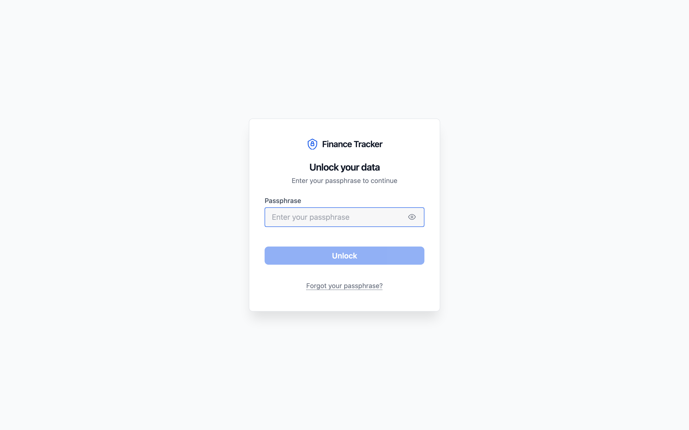

### 3. Add your first account

Go to Net Worth → Accounts and add an account you actually look at every month, a checking account or retirement account works well. Give it a name, pick a type, and save. This is the foundation the dashboard, allocation planner, and goals all build on.

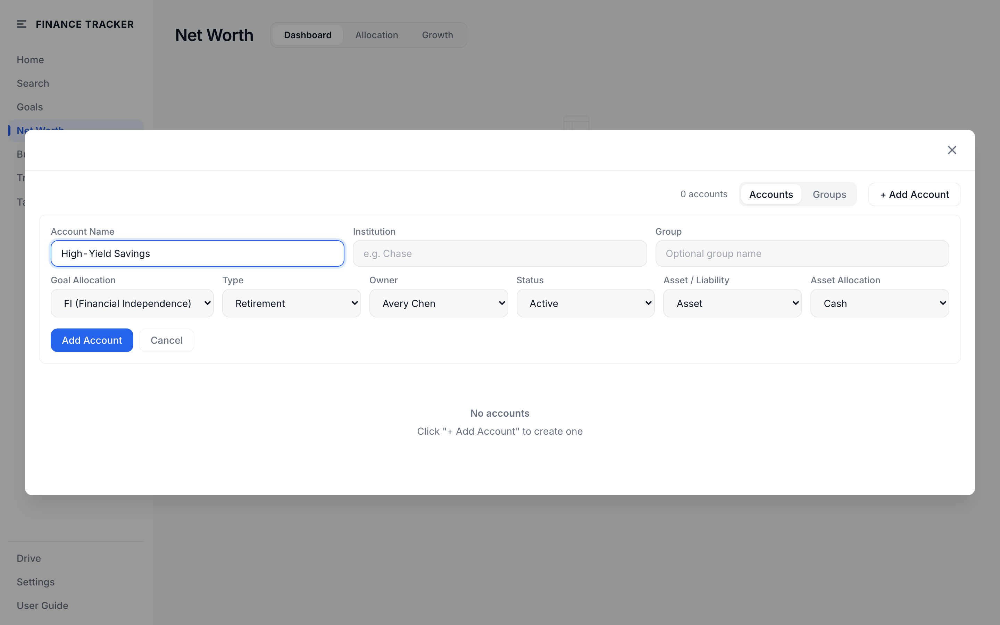

### 4. Enter a monthly balance

Open that account and add this month's balance. That is enough to make the charts wake up. Come back next month and add another point. You do not need perfect history to get value from it.

### 5. Let the rest of the app unfold from there

Go back Home. You'll see the net worth summary, mini charts, goals peek, and allocation bar start to take shape. From there, add a goal, import a budget CSV, or drop your tax documents into Drive. The app is modular. You can grow into it.

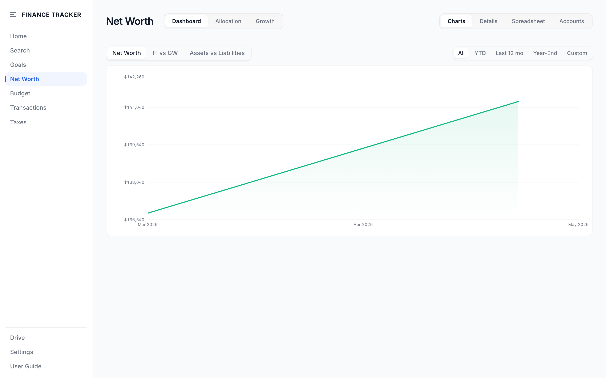

---

## Features, by page

### Home

Your dashboard. A quick read on where things stand right now, without opening six tabs or a spreadsheet you have to mentally parse before coffee.

**How to use it**
- Glance at current net worth and the delta from the previous month
- Flip through the mini charts for Net Worth, FI vs GW, and Assets vs Liabilities
- Use the goals peek to see which targets are on pace and which ones are drifting
- Check the allocation bar to see where your money is actually sitting today
- Drag and reorder the cards until the page matches the way you think

**One tip:** Put the card you check most often in the top-left slot. The dashboard remembers the order, and the right first glance matters more than one more chart.

---

### Goals

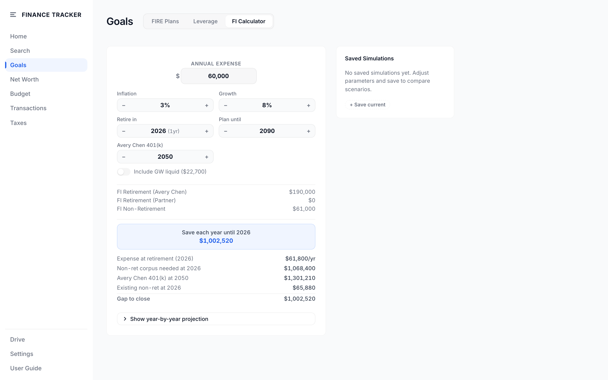

Two modes live here: concrete plans and a more abstract FI calculator. One keeps you honest about named goals. The other answers the older, quieter question of when work becomes optional.

**How to use it**
- Use the Plans tab for savings or investment goals with target amounts and dates
- Duplicate a goal when you want to try a more conservative or more aggressive version
- Reorder goals so the ones that matter this year stay near the top
- Mix and match goals to see how they stack together
- Use the Calculator tab to estimate years to financial independence from savings rate and expenses

**One tip:** Create one practical goal and one aspirational one. A near-term emergency fund and a long-term FI target make the page useful in two different time horizons.

---

### Net Worth

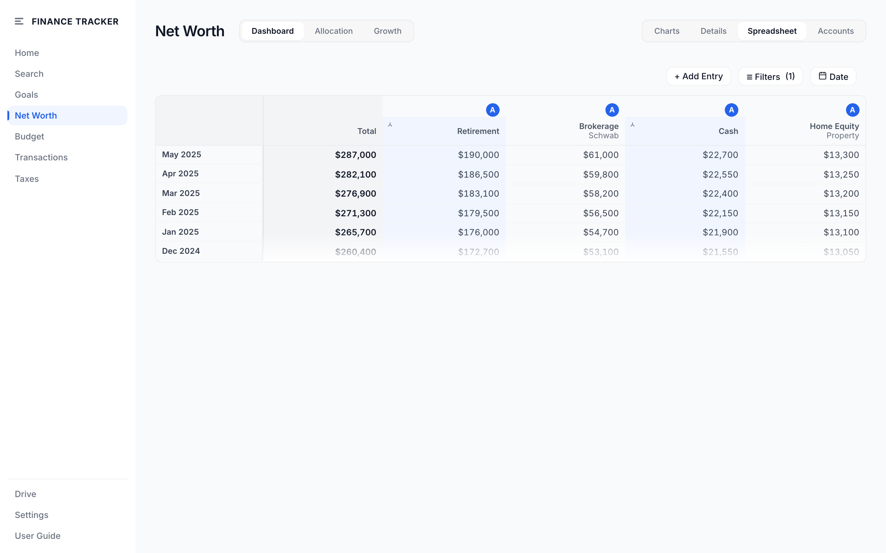

This is the spine of the app. The Accounts tab gives you the raw history, Allocation turns it into portfolio shape, and Growth lets you connect balances to income, expenses, and savings rate.

**How to use it**
- In Accounts, add accounts and enter monthly balances over time
- Switch between chart view and spreadsheet view depending on whether you want trend or detail
- Hover chart points to see deltas and how a month changed relative to the prior one
- Filter the accounts table when you want to isolate cash, retirement, debt, or other slices
- In Allocation, create custom ratio tabs for your ideal asset mix
- In Growth, log yearly income, expenses, and savings to keep the balance history grounded in behavior

**One tip:** Use Accounts for what happened, Allocation for what you want, and Growth for why the gap exists. The three tabs make more sense when you think of them as history, target, and explanation.

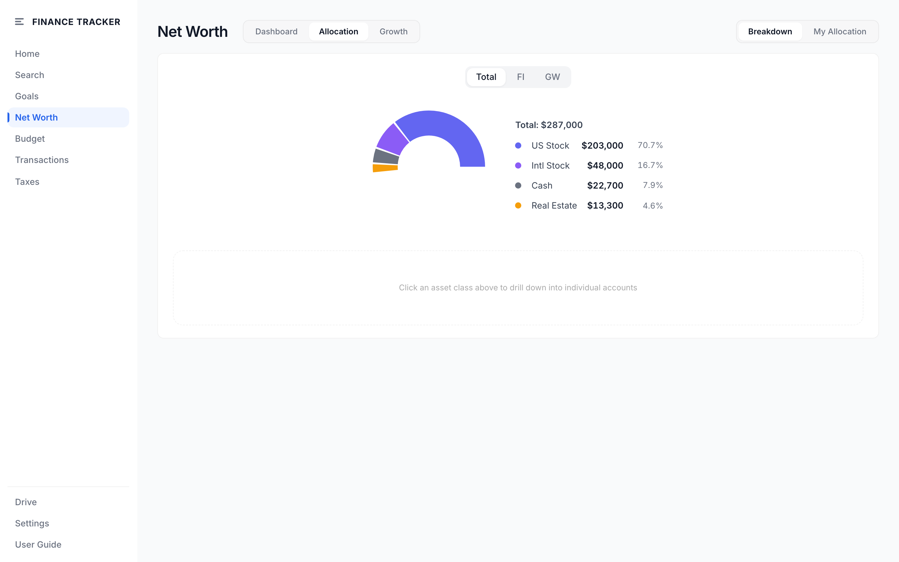

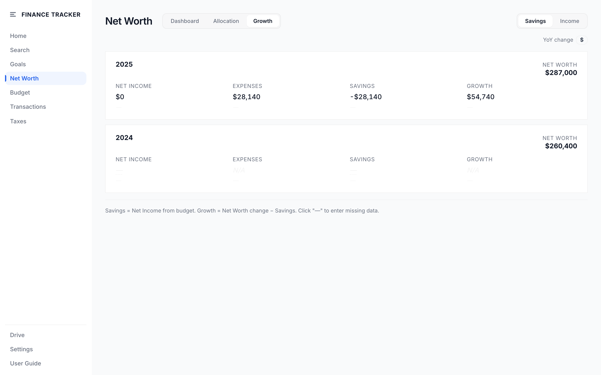

---

### Budget

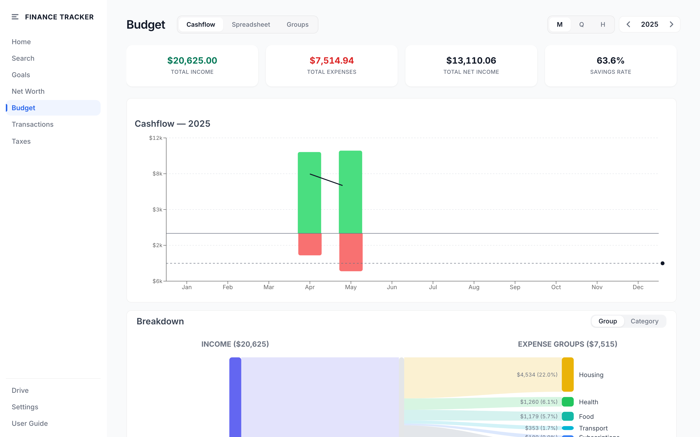

A year-based budgeting workspace that is more interested in patterns than ceremony. Import bank CSVs, clean them up, and look at spending from different distances.

**How to use it**
- Pick a year and import bank or card CSVs, or enter transactions manually
- Use the Detailed view for category-by-category breakdowns inside each group
- Switch to Aggregated when you only want group totals
- Use Cashflow to read income against expenses over time
- Change the period between monthly, quarterly, and half-yearly views
- Use the built-in PDF → CSV converter when the bank only gives you a statement PDF

**One tip:** Start in Aggregated view the first time you import a messy file. It lets you find the categories that matter before you get lost in line items.

---

### Transactions

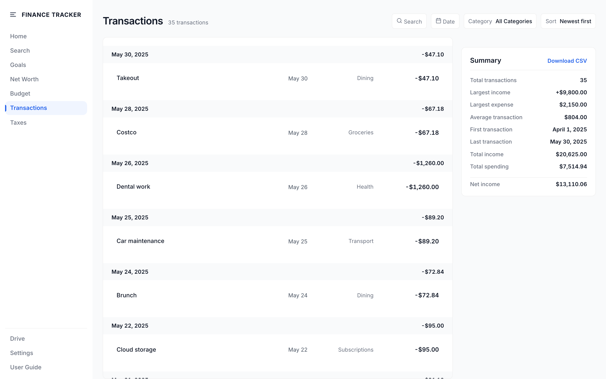

Transaction management lives on its own page now, separate from Budget. It is for the raw stream of money in and out, with filtering and categorization that helps you clean things up before they become a reporting habit.

**How to use it**
- Review transactions separately from annual budget rollups
- Filter the list when you want to isolate one account, merchant, or category pattern
- Categorize or recategorize items before they pollute your longer-term summaries
- Use it as the place for cleanup work, not just for reading totals

**One tip:** Treat Transactions as the inbox and Budget as the monthly summary. One is where you fix the raw data, the other is where you look for meaning.

---

### Taxes

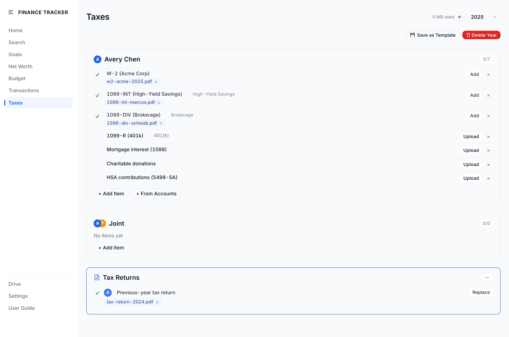

A yearly tax binder without the actual binder. Checklists, uploads, linked accounts, and reusable templates, all organized by year.

**How to use it**
- Move between tax years with the year navigation
- Upload W-2s, 1099s, receipts, and whatever else tends to arrive at inconvenient times
- Work through the checklist and mark items done as they land
- Use linked-account suggestions when you want the app to help connect documents to the right places
- Save or import templates so each year does not start from a blank page

**One tip:** Build next year's template the week you finish this year's return. Your future self will still remember what was annoying.

---

### Drive

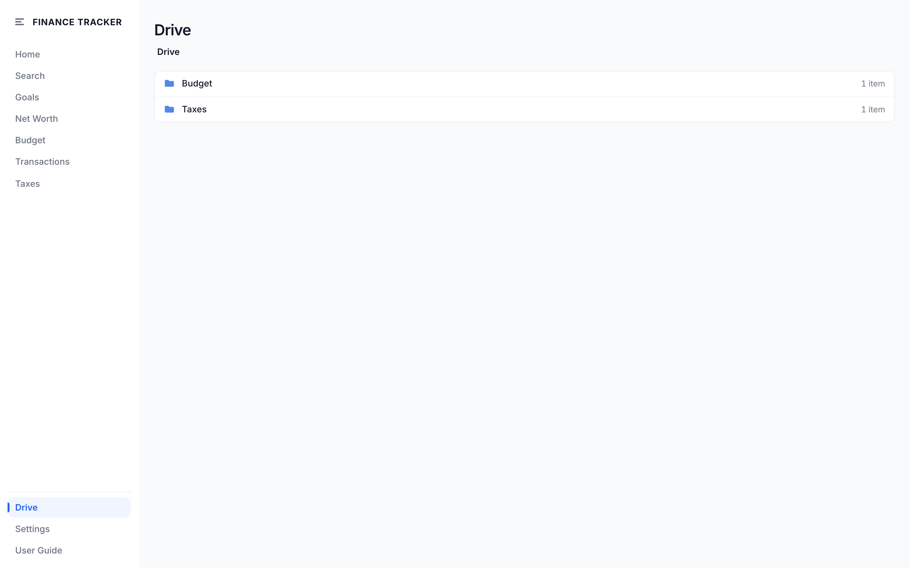

Drive is the app's file browser for uploaded documents. It gives you one place to browse the practical debris of personal finance, with enough structure to make it useful instead of decorative.

**How to use it**
- Browse uploaded files and folders with breadcrumbs
- Sort and filter when the list gets noisy
- Open CSV previews before you decide what to keep or rename
- Use it as the home for tax files, imported budget data, and other uploads that should stay close to the rest of the app

**One tip:** Rename files while they still mean something to you. "Statement.pdf" is readable today and useless six months from now.

---

### Settings

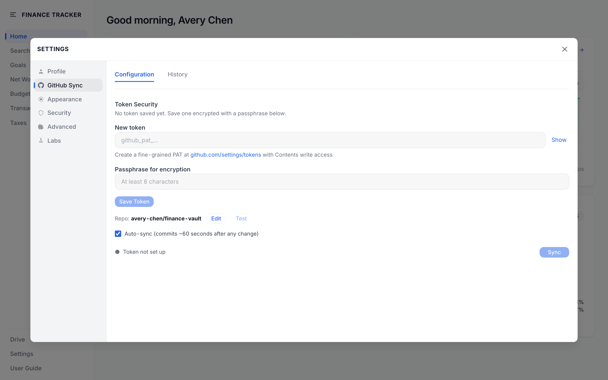

Profile, data folder, appearance, and the slightly more dangerous switches all live here.

**How to use it**
- Change or disconnect your data folder in Data Folder
- Toggle dark mode and accent preferences in Appearance
- Toggle the "Allow CSV imports & resets" switch in Advanced when you want bulk data entry tools
- Explore experimental features in Labs and Feature Flags when you are curious

**One tip:** If you move or rename the folder on disk, use Settings → Data Folder → Change Folder to reconnect it. Disconnecting only forgets the handle; your files stay exactly where they are.

---

## Common questions

### Is this free?

Yes. Forever. No paid tier, no premium features, no upsell. The app is open source under MIT.

### Where does my data go?

A folder on your own machine. On first run you pick a folder; the app stores everything there as plain files. You can open the folder in Finder or Explorer right now and read the files. Nothing leaves your device.

### How do I use this on two devices?

Point both at the same folder. If the folder is inside a synced directory (iCloud Drive, Dropbox, or similar) both devices see the same files automatically. If it is not synced, copy the folder manually from one machine to the other. The app has no built-in sync mechanism because plain files already have a thousand backup tools designed for them.

### What if I move or rename the folder?

Open Settings → Data Folder and click "Change Folder". Pick the new location and grant access. Disconnecting only forgets the folder handle; your files stay on disk wherever you left them.

### Can I export my data?

You already have it. Open the data folder in Finder or Explorer. The JSON files are readable as-is. The CSV files open in Excel or Numbers. There is nothing to export because the files are the data.

### Does it work offline?

Yes, once loaded. The app is a static bundle. After the first visit, your browser caches it and you can use it on a plane, in a tunnel, or with your wifi off.

### What if I lose my passphrase?

There is no passphrase. Your data is plain files with no application-level encryption. Your files are protected by whatever protects your disk, ideally full-disk encryption at the OS level.

### Is this audited or production-grade?

No formal audit. One person built it. It's used daily by its author. Treat it as a personal tool, not a bank.

### Why should I trust this?

You shouldn't blindly trust anything with your financial data. Here's what's true: the source code is public, the app makes no network calls at all, and your data is readable plain files on your own disk. Read the code. Or just try it with one account and see for yourself.

### Is this open source?

Yes. MIT license. Source is at [github.com/dutta14/finance-tracking](https://github.com/dutta14/finance-tracking). Read it, fork it, run it yourself.

### What's the difference between Budget and Transactions?

Transactions is for the raw list: filter, inspect, correct, categorize. Budget is for the roll-up: detailed, aggregated, or cashflow views across a whole year. If you are fixing individual entries, start in Transactions. If you are asking where the money went, start in Budget.

### Do I need to use every page?

No. The app works fine as a net-worth tracker with goals. Or as a budget tool with tax storage. Or as a private archive for documents. Use the parts that solve your actual problem.

### Why no mobile app?

The web app works on mobile browsers, though the File System Access API is not available in mobile browsers yet, which means you cannot use the full app on a phone. Add the site to your home screen on iOS or Android if you want quick access to read-only views, but for data entry, a desktop browser is the right tool right now.

---

## More

- **Self-host or contribute:** see [CONTRIBUTING.md](https://github.com/dutta14/finance-tracking/blob/main/CONTRIBUTING.md)
- **Source code:** [github.com/dutta14/finance-tracking](https://github.com/dutta14/finance-tracking)
- **Anindya's blog:** [anindya.dev/blog](https://anindya.dev/blog)
- **License:** MIT

Built in the open, for an audience of one. Useful to anyone who wants the same thing.
